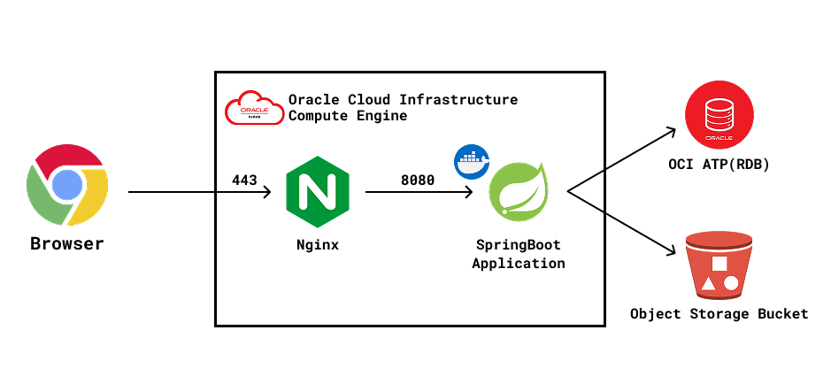

# 개인 Blog 서버

## 소개

### 동기
이 프로젝트는 개인 블로그를 위한 백엔드 서버를 구축하기 위해 시작되었습니다. 현대적인 웹 기술과 Spring Boot 프레임워크를 활용하여 안정적이고 확장 가능한 블로그 플랫폼을 제공하는 것이 목표입니다. 사용자들이 쉽게 콘텐츠를 소비하고, 관리자가 효율적으로 콘텐츠를 관리할 수 있는 시스템을 구축하고자 합니다.

### 기능
- **게시물 관리**: 게시물 조회, 생성, 수정, 삭제 기능
- **카테고리 관리**: 게시물 분류를 위한 카테고리 시스템
- **댓글 시스템**: 게시물에 대한 댓글 작성 및 관리
- **이미지 업로드**: 게시물에 이미지 첨부 기능
- **사용자 인증**: 관리자 로그인 및 인증 시스템
- **API 문서화**: Swagger를 통한 자동 API 문서 생성
- **LLM Client**: 게시글 요약과 메타데이터 생성을 위한 AI Client

## 구현

### Architecture

### 기술 스택
- **언어**: Java 17
- **프레임워크**
  - Spring Boot 3.4.5
  - Spring Security
  - Spring Data JPA
  - Spring AI
- **데이터베이스**: Oracle ATP(real), H2 Database(test)
- **이미지 저장**: OCI Object Storage Bucket
- **API 문서화**: SpringDoc OpenAPI (Swagger)
- **빌드 도구**: Gradle

## ETC

### In the future...
- 이미지 업로드 기능 완성
- 관리자 기능 구현 완료 (현재 계획된 기능 중 일부는 아직 구현 중)
- 사용자 프로필 및 권한 시스템 확장
- 검색 기능 추가
- 소셜 미디어 통합
- 성능 최적화 및 캐싱 구현