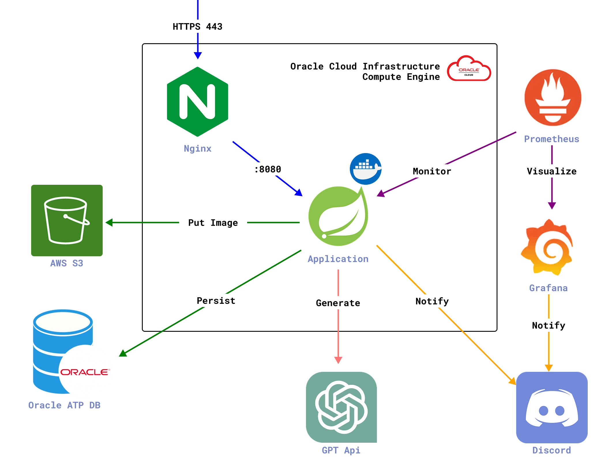

# 개인 Blog 서버

### 소개
이 프로젝트는 [개인 기술블로그](bumsiku.kr)용 백엔드 서버를 구축하며, **실무에서 요구되는 소프트웨어 개발 전체 과정을 경험하기 위해** 시작되었습니다.

- **RESTful API** 설계를 통한 깔끔한 인터페이스 구성
- **TDD** (테스트 주도 개발) 로 안정적인 코드 작성
  - **90% 이상**의 테스트 커버리지
- **Discord**, **Prometheus**, **Grafana를** 이용한 시스템 모니터링 
- **GitHub Actions**를 사용한 CI/CD 파이프라인 자동화

### 기능
- **게시물 관리**: 게시물 조회, 생성, 수정, 삭제 기능
- **카테고리 관리**: 게시물 분류를 위한 카테고리 시스템
- **댓글 시스템**: 게시물에 대한 댓글 작성 및 관리
- **이미지 업로드**: 게시물에 이미지 첨부 및 용량 최적화
- **사용자 인증**: 관리자 로그인 및 인증 시스템
- **API 문서화**: Swagger를 통한 자동 API 문서 생성

### Architecture

### 기술 스택
- **언어**: Java 17
- **프레임워크**
  - Spring Boot 3.4
  - Spring Security
  - Spring Data JPA
- **데이터베이스**: MySQL(real), H2 Database(test)
- **이미지 저장**: AWS S3
- **API 문서화**: SpringDoc OpenAPI (Swagger)
- **빌드 도구**: Gradle, Docker, Github Actions

### In the future...

- 스트레스 테스트: 일정 개수 이상의 게시글이 저장되었을 때
- 성능 최적화 및 캐싱 구현